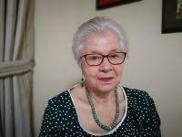

## **Oí decir del Usékar de Maria Eugenia Bozzoli** 

### Oí decir del Usékar es una etnografía de la autora María Eugenia Bozzoli. La autora nos introduce explicándonos sobre los cargos y jefaturas de las sociedades indígenas que sobrevivieron a la colonia y el primer siglo de la vida republicana, aclarando aspectos de la antigua estructura sociopolítica de los cacicazgos de la época que arribó Cristóbal Colón a Cariari. Menciona que al igual del cargo del cacique existían otros cargos con niveles importantes ya que cumplían funciones especializadas e indispensables en el sistema.

### Algunos cargos conocidos entre los bribris y cabecáres:
- úsekar, rey (blu’, bulu’, blupa’, bulu’pa, bur, buru, brupa, burupa), 
- cantores fúnebres (jtsököl, jtsökölpa, stsökölpa, sucur, sugur, isogro),
- los awápa o jawáwá (sukias, médicos),
- maestros de ceremonias (bikakra, bikakrapa, bikaklapa, mkakla,
- los sepulteros (óköm, óköb, óköpa, ókömpa).

###  Hace énfasis en que el objetivo del ensayo escrito por ella tiene como objetivo sobre el cargo Usékar, es como un tipo sacerdote el cual estaba considerado por los indígenas bribis y cabécares como la autoridad con un alto rango político y religioso hasta los años 1930 y lo sigue siendo en la memoria histórica de los talamanqueños según la autora. Este documento es parte de una colección: ***V Centenario del IV viaje de Cristóbal Colón***, para este se editaron 3 obras relacionadas con los acontecimientos de 1502. Para realizar esta etnografía la investigadora se basó en la técnica de documentales donde recolecta diversas fuentes y documentos para relatar lo que fue la máxima autoridad en la sociedad cacical talamanqueña y la importancia de su memoria para la actual sociedad bribri-cabécar. Como metodología sólo expone que realizará un ensayo a partir de fuentes y documentos.
### Procede a narrar en tercera persona, va citando textualmente y se refiere a cada apartado explicando puntos o apoyándose de estos. Presenta 4 láminas de figuras que eran propiedad de los Usékares; *Lámina I Colgante en forma de ave, Lámina II Colgante en forma de cangrejo y Lámina III Colgante de figuras humanizadas de 2 caracoles y IV Colgante con figura de felino humanizado.* Las partes de este ensayo están estructuradas de la siguiente manera: Introducción, Memorias de los siglos XIX y XX, Regreso al lugar de origen, Historias Usékares- Cap I De los orígenes del Usékar, Cap II De su clan y de sus clanes relacionados, Cap III De los poderes del Usékar, Conclusiones, Bibliografía consultada y Contenido.

##  María Eugenia Bozzoli Vargas 

### Nació el 26 de mayo de 1935 en San Marcos de Tarrazú, es socióloga y antropóloga. Es graduada en las universidades de Kansas [Lawrence](https://www.ku.edu/) y de Georgia [Athens](https://www.uga.edu/). A partir de 1962 en la Universidad de Costa Rica se desempeñó como docente, investigadora y en posiciones administrativas, tales como vicerrectora de Acción Social y directora del Consejo Universitario. En 1992 fue nombrada profesora Emérita en la Escuela de Antropología y Sociología en la Universidad de Costa Rica. Fue electa para el cargo de Concejal de la Universidad Estatal a Distancia de Costa Rica, como representante de la Comunidad Nacional. Su trabajo de campo ha abordado vida indígena y campesina criolla, desarrollo sostenible, antropología aplicada y diversidad cultural costarricense, lo cual se evidencia en sus numerosas publicaciones. Recibió el premio Malinowski del año 2000, otorgado por la Sociedad de Antropología aplicada de los Estados Unidos (Malinowski Award, The Society for Applied Anthropology) y el premio Magón 2001. Que es el reconocimiento máximo del Estado Costarricense por contribuciones en el campo cultural. 
